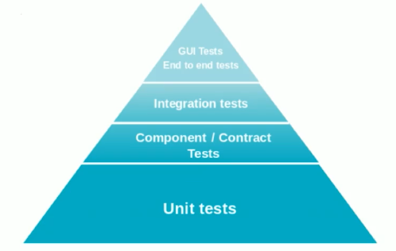

# Testing

* Es un proceso, una método de trabajo y una herramienta que tiene como fin identificar defectos en el software, con el objetivo final de ayudar a alcanzar un grado aceptable de madurez y estabilidad de una aplicación.

## Piramide de testing

* Unit test: Las pruebas que se dedican a los componentes más pequeños del sofware, como funciones, resultados de ejecución como tal.
* Components: Ya son partes más grandes de la aplicación que tienen varias funciones.
* Integration: Se refiere a la integración de los diferentes componentes de la aplicación.
* End to End: Es el testing de la Interfaz del usuario como tal.

### End to End

* Es la metodología que prueba desde el punto de vista del usuario final del aplicativo.
* Prueba todo el flujo del programa desde la interacción con la interfaz gráfica del mismo.
* El foco es detectar posibles problemas que van a encontrar nuestros usuarios en el flujo general del programa.
* Se va emular a un usuario como tal y se va programar la interacción de un usuario con un browser, permitiendonos probar todo el flujo desde el inicio hasta el final.